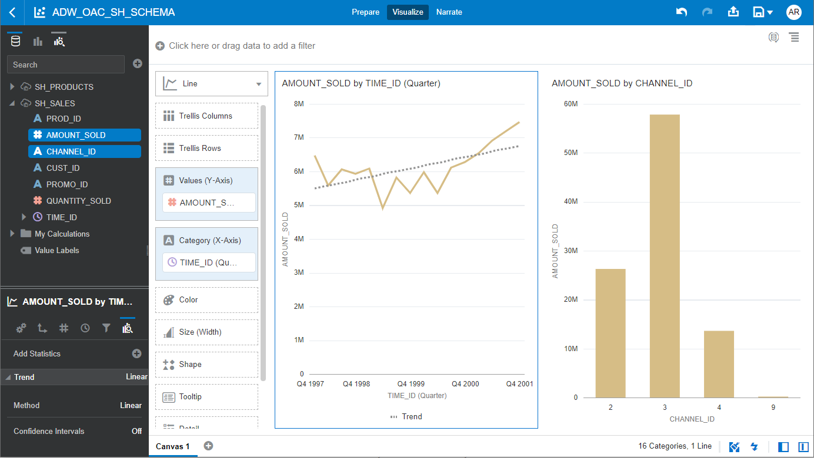
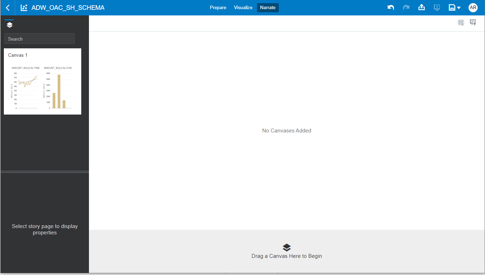
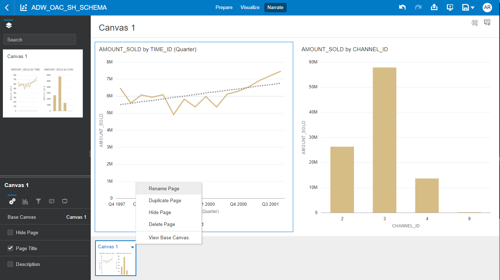
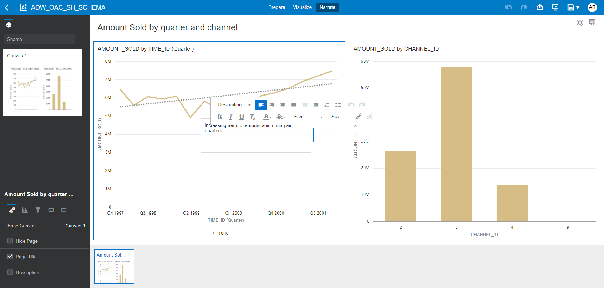
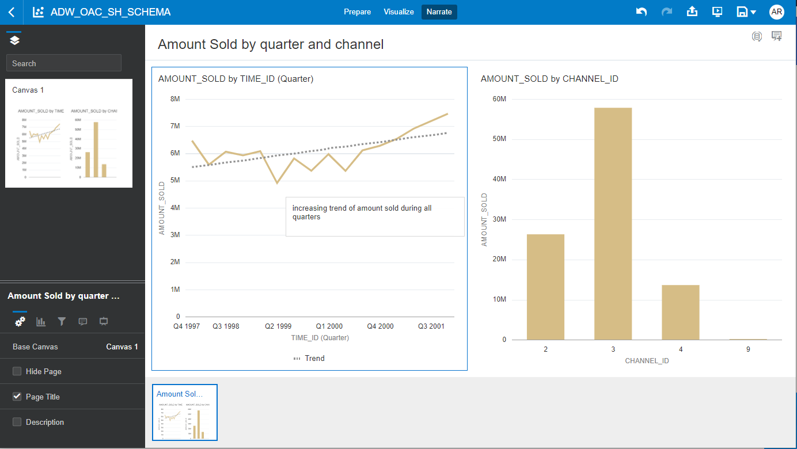
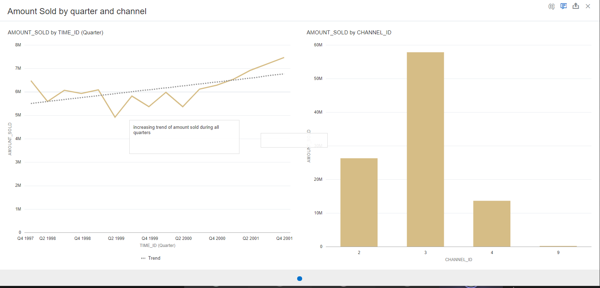

# Capture Insights in Oracle Analytics Cloud (OAC)

## Introduction

While developing data visualizations, you can capture memorable information in an insight. An insight is a snapshot of any information that you see in visualizations. You can change and refine insights as needed and share your insights with others. You share insights in the form of a story.

After goingt through the lab "Using Oracle Analytics Cloud", this lab is going to reuse the work done for presenting a way of sharing your insights.
You are going the **Oracle Analytics Cloud** instance already deployed in the past Labs.

### Objectives

- **Capture Insight** from Oracle Analytics Cloud 

Estimated Lab Time: 15 minutes

## **STEP 1**: Create insights from Oracle Analytics Cloud 

> **Note**: This section assumes you have already created your Oracle Analytics Cloud instance as part of the 'Lab 2 - Provisioning your Oracle Analytics Cloud (OAC)' instance section. If not, please return to the beginning of Lab2 and go through the instance creation.
> **Note**: This section assumes you have already created some visualizations as part of the 'Lab 3 - Using Oracle Analytics Cloud (OAC)'.

1. ### Create another visualization. Click on AMOUNT_SOLD and CHANNEL_ID, drag and drop both fields to the right margin of the canvas.

     

2. ### In the project, Click Narrate. In the Narrate page, drag Canvas 1 to Drag a canvas here to begin.

     

     

3. ### Click the menu in Canvas 1, and select Rename Page. Enter Amount Sold by quarter and channel in the page title to replace Canvas 1.

     

     

3. ### Click the menu in Canvas 1, and select Rename Page. Enter Amount Sold by quarter and channel in the page title to replace Canvas 1.

     

     

4. ### Click Add NoteAdd Note icon. In the note , enter the following:
Increasing trend of amount sold during all quarters.

     

5. ### In Narrate, click Present. If necessary, select and move the note to show the entire canvas.

     

     

6. ### Click close Close presentation icon.
7. ### Click Save.

*Congratulations! Well done!*

## **Acknowledgements**

- **Last Updated By/Date** - Antonio Gomez, April 2021
