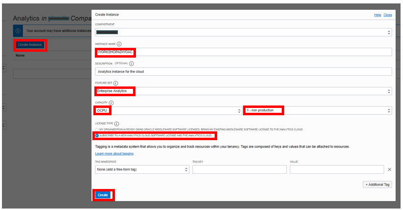

# Provisioning your Oracle Analytics Cloud (OAC) instance

## Introduction

This section describes the process of deploying **Oracle Analytics Cloud** instances on Oracle Cloud Infrastructure Gen 2, which is the default for newly provisioned accounts in **EMEA** and **US**.

Your Oracle Cloud Free Tier account will use the Oracle Cloud Free Trial **credits** while this instance is provisioned, as Oracle Analytics Cloud is not part of the **Always Free** cloud services.

Provisioning an Oracle Analytics Cloud instance can take over **40 minutes**.

Watch our short video that explains Lab 2 - Provisioning your Oracle Analytics Cloud instance:

Estimated workshop Time 15 minutes.

### Objectives
- Create an Oracle Analytics Cloud Instance

## **STEP 1**: Create an Oracle Analytics Cloud (OAC) Instance

Return to the Oracle Cloud Infrastructure Console accessing from **Oracle Home Page** (oracle.com) and sign in into your cloud account.
Click in **View Account** and **Sign in to Cloud**.

1. Click on the menu icon on the left. Verify that you are signed in as a **Single Sign On** (Federated user) user by selecting the **Profile** icon
in the top right hand side of your screen. If your username is shown as:

    > oracleidentitycloudservice/&lt;your username&gt;
    >
    Then you are **connected** as a **Single Sign On** user.

    

    If your username is shown as:

    > &lt;your username&gt;
    >
    Then you are **signed in** as an **Oracle Cloud Infrastructure** user.

    

    If your user does not contain the identity provider (**oracleidentitycloudprovider**), please logout and select to authenticate
    using **Single Sign On**.

    

    To be capable of using **Oracle Analytics Cloud** we need to be Sign-On as a **Single Sign-On** (SSO) user.

    [More information about federated users](https://docs.cloud.oracle.com/en-us/iaas/Content/Identity/Tasks/usingscim.htm).

2. Return to the *Home Console Page* and navigate to **Analytics** under **Solutions and Platform** section and then **Analytics Cloud**.

    

    > **Note**: You must be connected as a **Single Sign On** (**Federated** user) user to a tenancy, which has available cloud credits to see this menu item. Local OCI users are not able to do this.

3. Select **Create Instance**.

    Complete the form using the following information:

    >**Compartment**: Select a valid compartment in your tenancy
    >
    >**Instance Name**: WORKSHOPADWOAC
    >
    >**Description**: &lt;optional&gt;
    >
    >**Feature Set**: Enterprise Analytics (important)
    >
    >**Capacity**: 1 - Non Production
    >
    >**License Type**: "Subscribe to a new Analytics Cloud software > license and the Analytics Cloud." (You will use this service as part of the free Oracle Cloud trial that you requested for this workshop).

4. Select **Create**.

    

5. On the **Confirmation** screen, select **Create**.

    The Analytics instance page will be displayed with a status of ***CREATING***.

    

    ***Reminder***: Provisioning an Oracle Analytics Cloud instance can take over **40 minutes**.

6. The Analytics instance page will be displayed with a status of ***ACTIVE***.

    

## **STEP 2**: Create an Oracle Cloud User - OPTIONAL

1. From the Oracle Cloud Infrastructure Console, click the navigation menu Navigation menu icon in the top left corner, expand Identity, and then click Federation.

2. In the Federation page, click the Oracle Identity Cloud Service Console link.
In the Identity Cloud Service page, click Create User button.

3. Add new username information. In the First Name and Last Name fields of the Create User window, enter the user’s first and last name.
To have the user log in to Oracle Identity Cloud Service with their email address, in the User Name field, enter the email address for the user account.
Select the OCI Group for the new user and click create.
We propose to use a generic john.doe@mail.com user

## **STEP 3**: Give appropiate access and permissions to user in OAC - OPTIONAL

Let' create a new custom role into OAC and assign that role to our new user

1. From the Oracle Analytics Cloud Service Console, click the navigation menu icon in the top left corner, expand and click Console and then select Users and Roles

2. Click the Application Roles tab, then Click Add.
Enter a name and describe the application role. Click Save. Initially, new application roles don't have any members or privileges.
Example: Analists | Analists

3. Add privileges to the new application role: 
Click the action menu on the new created Role "Analists".
Select Manage Application Roles.

Click Search with * in the search box.
Select "DV Content Author" and the arrow pointing to the right

4. Add user to the role:  
Click the action menu on the new created Role "Analists".
Select Manage Members.

Click Search with the * in the search box.
Select our new user

5. Add access to Catalog Objects

Open Classic Home from the top right menu icon

Navigate to the catalog object and open permissions dialog Catalog objects can include folders, projects and so on.

Search for the New Role.

Set the level of permissions (Modify).

When you grant catalog permissions through application roles, all the members you assign to that role inherit the same permissions

*You can proceed to the next lab…*

## **Acknowledgements**

- **Author** - Priscila Iruela - Database Business Development | Juan Antonio Martin Pedro - Analytics Business Development
- **Contributors** - Victor Martin, Melanie Ashworth-March, Andrea Zengin
- **Last Updated By/Date** - Kamryn Vinson, October 2020

- **Optional Part** - Antonio Gomez, April 2021

